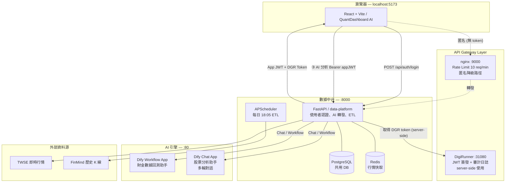

# QuantDashboard AI — 智能台股量化分析助手

> 基於 **React + Vite** 前端、**FastAPI** 數據中台、**Dify.ai** AI 對話引擎、**DigiRunner** JWT API Gateway 的全端台股量化分析平台。
> 支援使用者系統、多輪對話、即時技術指標分析與投資組合管理。

---

## 系統架構



### 元件說明

| 元件 | 技術 | Port | 說明 |
|------|------|------|------|
| 前端 | React 18 + Vite + Tailwind CSS | 5173 | 主介面，Docker 容器化 |
| DigiRunner | tpisoftware/digirunner v4.7.3 | 31080 | JWT gateway，API 路由 + 審計日誌 |
| nginx | nginx:alpine | 9000 | 匿名降級路徑，rate limit 10 req/min |
| data-platform | FastAPI + asyncpg | 8000 | 使用者認證、AI 轉發、ETL、watchlist |
| Dify | langgenius/dify v1.13 | 80 | AI Workflow + Chat 多輪對話 |
| PostgreSQL | postgres:15 | 5432 | 共用資料庫（Dify + data-platform） |
| Redis | redis:6 | 6379 | 即時行情快取（30s TTL） |

---

## 核心功能

### 🔐 使用者系統
- 帳號註冊 / 登入（bcrypt + HS256 JWT）
- 登入後 server-side 自動取得 DigiRunner gateway token
- 每位使用者獨立 watchlist（PostgreSQL per-user 隔離）
- 未登入用戶可匿名使用（走 nginx gateway，有 rate limit）

### 🤖 對話式 AI 分析（多輪對話）
- 類 ChatGPT 介面，支援台股代號（`2330`）或中文名稱（`台積電`）
- **Dify Chat 模式**：`conversation_id` 跨輪保留，支援追問（「那 RSI 超買要怎麼操作？」）
- 自動帶入前 2 輪查詢上下文
- 一次輸入多檔代號（`2330 2317`）批次分析
- 一般財經問答（非個股查詢由 AI 回答通用問題）

### 📊 即時儀表板（4 個分頁）

| 分頁 | 內容 |
|------|------|
| **總覽** | 即時股價、MA5、趨勢判斷、RSI 儀表板、即時行情卡（5 秒更新）、K 線圖 |
| **技術指標** | KD 圖表、MACD 圖表、綜合訊號判定（多/空/中性）、智慧警報設定 |
| **歷史趨勢** | RSI / KD / MACD 歷史折線圖、日期篩選、年化報酬率、多股比較（最多 4 檔）|
| **自選** | 個人 watchlist + 即時報價（30 秒）、持股成本輸入、未實現損益、組合圓餅圖 |

### 📈 K 線圖
- 台股 K 棒（漲紅跌綠）+ 底部成交量
- MA5 / MA20 / MA60 均線切換
- 時間段：1D / 1W / 1M / 3M / 6M / 1Y / 3Y / 5Y
- localStorage 快取 + 增量更新

### 🔔 智慧警報
- 自訂條件（`RSI > 70`、`價格 < 500`）
- 瀏覽器推播 + EmailJS 信箱通知

---

## 快速啟動

### 前置需求
- Docker Desktop
- Node.js 18+（本地開發用）

### 1. 複製專案

```bash
git clone https://github.com/kevinzeroCode/GDG-opentpi-2026.git
cd GDG-opentpi-2026
```

### 2. 啟動所有服務

```bash
# Dify（AI 引擎）
cd ../dify/docker && docker compose up -d

# 數據中台 + nginx gateway
cd ../../data-platform && docker compose up -d

# 前端 + DigiRunner
cd "../QuantDashboard AI" && docker compose up -d
```

或使用一鍵啟動腳本（Windows）：
```bash
start.bat
```

### 3. 初始化 Dify

1. 開啟 `http://localhost:80`，完成管理員帳號設定
2. 匯入 `dify_config/` 下的兩個 DSL 檔案：
   - `財金數據回測助手.yml`（Workflow App）
   - `stock_chat_app.yml`（Chat App）
3. 各 App 點「**發布**」後，複製 API Key 填入 `data-platform/.env`

### 4. 環境設定

**`QuantDashboard AI/.env`**
```env
VITE_API_BASE_URL=http://localhost:8000
VITE_GATEWAY_URL=http://localhost:9000/gateway
VITE_DIGIRUNNER_URL=http://localhost:31080
VITE_EMAILJS_SERVICE_ID=your_service_id
VITE_EMAILJS_TEMPLATE_ID=your_template_id
VITE_EMAILJS_PUBLIC_KEY=your_public_key
```

**`data-platform/.env`**
```env
DB_HOST=docker-db_postgres-1
DB_NAME=dify
DB_USER=postgres
DB_PASSWORD=difyai123456
REDIS_URL=redis://redis:6379/1
DIFY_API_KEY=app-xxxxxxxx          # Workflow App key
DIFY_CHAT_API_KEY=app-xxxxxxxx     # Chat App key
CORS_ORIGINS=http://localhost:5173
```

### 5. 開啟瀏覽器

```
http://localhost:5173
```

---

## 專案結構

```
GDG/
├── QuantDashboard AI/              # React + Vite 前端
│   ├── src/
│   │   ├── hooks/
│   │   │   ├── useAuth.js          # 統一認證 hook（App JWT + DGR token）
│   │   │   ├── useDifyAPI.js       # AI 分析 hook（Chat 多輪 + 對話上下文）
│   │   │   └── useTWSELive.js      # 即時行情 hook（5 秒輪詢）
│   │   ├── utils/
│   │   │   ├── watchlist.js        # 自選清單（含 platform 同步）
│   │   │   ├── parser.js           # 指標文字解析器
│   │   │   ├── alerts.js           # 智慧警報
│   │   │   └── tickerNames.js      # 中文名稱 ↔ 代號對照
│   │   └── App.jsx                 # 主介面（含登入/註冊 Modal）
│   ├── docker-compose.yml          # 前端 + DigiRunner
│   └── start.bat                   # 一鍵啟動腳本（Windows）
│
├── data-platform/                  # FastAPI 數據中台
│   ├── app/
│   │   ├── routers/
│   │   │   ├── auth.py             # POST /api/auth/register|login|me
│   │   │   ├── ai.py               # POST /api/ai/analyze（Chat 模式）
│   │   │   ├── watchlist.py        # GET/POST/DELETE /api/watchlist（per-user）
│   │   │   ├── stock.py            # GET /api/stock/live|history
│   │   │   └── etl.py              # POST /api/etl/run（手動觸發）
│   │   ├── services/
│   │   │   ├── auth_service.py     # bcrypt + JWT + DigiRunner token 取得
│   │   │   ├── dify_service.py     # Dify Chat / Workflow API 呼叫
│   │   │   ├── db_service.py       # 使用者 CRUD、watchlist、ETL 持久化
│   │   │   └── commentary_service.py  # 本地指標解說（Dify 降級備用）
│   │   ├── config.py               # 環境變數設定（pydantic-settings）
│   │   └── main.py                 # FastAPI app + startup hooks
│   ├── nginx/nginx.conf            # Rate limit gateway 設定
│   └── docker-compose.yml
│
├── dify/docker/                    # Dify 平台（langgenius/dify v1.13）
└── dify_config/
    ├── 財金數據回測助手.yml            # Dify Workflow DSL（匯入用）
    └── stock_chat_app.yml           # Dify Chat DSL（匯入用）
```

---

## API 路徑總覽

| 路徑 | 方法 | 說明 | 認證 |
|------|------|------|------|
| `/api/auth/register` | POST | 建立帳號，回傳 JWT + DGR token | 無 |
| `/api/auth/login` | POST | 登入，回傳 JWT + DGR token | 無 |
| `/api/auth/me` | GET | 取得當前使用者資訊 | App JWT |
| `/api/ai/analyze` | POST | AI 股票分析（Chat 多輪對話）| 無（限速）|
| `/api/watchlist` | GET/POST | 個人自選清單（登入後 per-user）| App JWT（可選）|
| `/api/watchlist/{ticker}` | DELETE | 移除自選股 | App JWT（可選）|
| `/api/stock/live/{ticker}` | GET | TWSE 即時行情（Redis 快取）| 無 |
| `/api/stock/history/{ticker}` | GET | FinMind 歷史 K 線 | 無 |
| `/api/etl/status` | GET | ETL 最後執行時間與狀態 | 無 |

---

## 路線圖

### ✅ Phase 1 — AI Gateway 整合
- [x] DigiRunner JWT 認證路徑（`/tsmpc/dgrc/ai_analyze`）
- [x] nginx gateway 匿名降級路徑（rate limit 保護）
- [x] Dify Chat 模式（`conversation_id` 多輪對話）
- [x] 對話上下文自動附加（最近 2 輪）

### ✅ Phase 2 — 後端強化
- [x] 使用者系統（bcrypt + HS256 JWT）
- [x] Server-side DigiRunner token 自動取得
- [x] Per-user watchlist（PostgreSQL 隔離）
- [x] ETL 持久化（`etl_runs` table）
- [x] Redis 快取即時行情

### ✅ Phase 2.5 — 即時功能修正
- [x] 槓桿型 ETF（`00631L` 等）ticker 正則修正（保留字母後綴）
- [x] TWSE 空殼回應過濾（無名稱且無價格時回傳 404，而非全 null 200）
- [x] Redis 快取 null 資料修正（重啟後清除）
- [x] K 線圖 / 價格走勢隨查詢股票正確切換（`lastTicker` 更新路徑修正）

### 🔲 Phase 3 — 雲端部署（待辦）
- [ ] 獨立 PostgreSQL（data-platform 脫離 Dify 共用 DB）
- [ ] Docker image 推上 GHCR（GitHub Container Registry）
- [ ] CI/CD Pipeline（GitHub Actions：lint → test → build → deploy）
- [ ] 部署至雲端（GCP Cloud Run / Fly.io / AWS EC2）
- [ ] HTTPS + 自訂網域（Let's Encrypt via Caddy / Cloudflare）
- [ ] 生產環境 SECRET 管理（GitHub Secrets / GCP Secret Manager）
- [ ] 監控 & 告警（Uptime Robot / Cloud Monitoring）

---

## 免責聲明

本專案僅供學習與技術研究使用，所提供之量化數據皆為技術指標解析，不構成任何投資建議。投資人應獨立判斷並自負風險。
