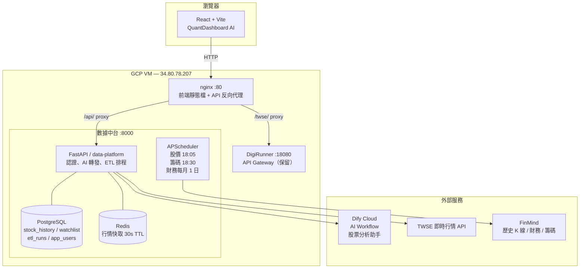

# QuantDashboard AI — 智能台股量化分析助手

[](https://github.com/kevinzeroCode/GDG-opentpi-2026/actions/workflows/ci.yml)
[](https://github.com/kevinzeroCode/GDG-opentpi-2026/actions/workflows/deploy.yml)


> 基於 **React + Vite** 前端、**FastAPI** 數據中台、**Dify.ai Cloud** AI 引擎的全端台股量化分析平台。
> 支援使用者系統、AI 多輪對話、即時技術指標分析、K 線 cache-aside、每日自動 ETL。

**線上展示：** http://34.80.78.207

---

## 系統架構



### 元件說明

| 元件 | 技術 | Port | 說明 |
|------|------|------|------|
| 前端 | React 18 + Vite + Tailwind CSS | 80 | nginx 容器化，靜態建置 |
| nginx | nginx:alpine | 80 | 靜態服務 + 反向代理 `/api/`、`/twse/`、`/dify/` |
| data-platform | FastAPI + asyncpg | 8000 | 認證、AI 轉發、ETL、watchlist、K 線 cache |
| PostgreSQL | postgres:16-alpine | 5432 | 股價歷史、使用者、watchlist、ETL 紀錄 |
| Redis | redis:7-alpine | 6379 | TWSE 即時行情快取（30s TTL） |
| DigiRunner | tpisoftware/digirunner | 18080 | API Gateway（保留備用） |
| Dify Cloud | api.dify.ai | — | AI Workflow，股票技術分析助手 |

---

## 核心功能

### 🤖 AI 對話分析
- 類 ChatGPT 介面，支援台股代號（`2330`）或中文名稱（`台積電`）
- Dify Workflow 分析技術指標（MA、RSI、KD、MACD）並生成解說
- 查詢完成後即時顯示「已識別股票：XXXX」確認訊息

### 📊 即時儀表板（4 個分頁）

| 分頁 | 內容 |
|------|------|
| **總覽** | 即時股價卡（5 秒更新）、MA5、趨勢判斷、RSI 儀表板、K 線圖 |
| **技術指標** | KD 圖表、MACD 圖表、綜合訊號判定、智慧警報設定 |
| **歷史趨勢** | RSI / KD / MACD 歷史折線圖、多股比較（最多 4 檔）|
| **自選** | 個人 watchlist + 即時報價（30 秒）、未實現損益、組合圓餅圖 |

### 📈 K 線圖（Cache-Aside）
- 查詢時先讀 PostgreSQL，無資料才向 FinMind 抓取並自動存入 DB
- 支援上市（TSE）及上櫃（OTC）股票
- 時間段：1D / 1W / 1M / 3M / 6M / 1Y / 3Y / 5Y
- 台股 K 棒（漲紅跌綠）+ MA5 / MA20 / MA60 均線

### ⏰ 自動 ETL 排程
- **股價**：每日 18:05，自動增量同步所有追蹤股票
- **籌碼**（三大法人 + 融資融券）：每日 18:30
- **財務**（月營收 + 季報）：每月 1 日 09:00
- 動態追蹤：任何用戶查詢過的股票自動加入同步清單

### 📅 非交易日備援
- 假日 / 休市時，TWSE 仍回傳舊量但無開盤價
- 自動偵測並切換為 DB 最後交易日資料顯示

### 🔐 使用者系統
- 帳號註冊 / 登入（bcrypt + HS256 JWT）
- 每位使用者獨立 watchlist（PostgreSQL per-user 隔離）

### 🔔 智慧警報
- 自訂條件（`RSI > 70`、`價格 < 500`）
- 瀏覽器推播 + EmailJS 信箱通知

---

## 快速啟動

### 前置需求
- Docker Desktop
- Node.js 20+（本地開發用）

### 1. 複製專案

```bash
git clone https://github.com/kevinzeroCode/GDG-opentpi-2026.git
cd GDG-opentpi-2026
```

### 2. 設定環境變數

**`data-platform/.env`**
```env
DB_HOST=postgres
DB_PORT=5432
DB_NAME=stockdb
DB_USER=postgres
DB_PASSWORD=stockdb1234
REDIS_URL=redis://redis:6379/1
DIFY_API_KEY=app-xxxxxxxx
DIFY_INTERNAL_URL=https://api.dify.ai/v1
JWT_SECRET=<openssl rand -hex 32>
CORS_ORIGINS=http://localhost:5173
```

### 3. 啟動服務

```bash
# 數據中台（PostgreSQL + Redis + FastAPI）
cd data-platform && docker compose up -d

# 前端（nginx + React build）
cd .. && docker compose up -d
```

### 4. 開啟瀏覽器

```
http://localhost:80
```

---

## 專案結構

```
GDG-opentpi-2026/
├── src/                            # React 前端
│   ├── hooks/
│   │   ├── useDifyAPI.js           # AI 分析 hook（股票代號解析）
│   │   └── useTWSELive.js          # 即時行情 hook（5 秒輪詢）
│   ├── utils/
│   │   ├── twseLive.js             # 呼叫 /api/stock/live-or-last
│   │   ├── tickerNames.js          # 中文名稱 ↔ 代號對照（含反向查詢）
│   │   ├── parser.js               # 指標文字解析器
│   │   └── alerts.js               # 智慧警報
│   └── App.jsx                     # 主介面
│
├── data-platform/                  # FastAPI 數據中台
│   ├── app/
│   │   ├── routers/
│   │   │   ├── auth.py             # 使用者認證
│   │   │   ├── ai.py               # AI 分析轉發
│   │   │   ├── stock.py            # 股價、K 線、即時行情
│   │   │   ├── watchlist.py        # 自選清單
│   │   │   ├── etl.py              # ETL 管理端點
│   │   │   ├── financial.py        # 財務資料
│   │   │   └── chips.py            # 籌碼資料
│   │   ├── services/
│   │   │   ├── etl_service.py      # 股價 ETL（動態追蹤清單）
│   │   │   ├── financial_service.py# 財務 ETL
│   │   │   ├── chips_service.py    # 籌碼 ETL
│   │   │   ├── twse_service.py     # TWSE 即時行情
│   │   │   ├── db_service.py       # DB CRUD
│   │   │   └── cache_service.py    # Redis 快取
│   │   └── main.py                 # FastAPI app + APScheduler
│   └── docker-compose.yml
│
├── nginx.conf                      # 前端 nginx 設定（反向代理）
├── docker-compose.yml              # 前端 + DigiRunner
├── dify_config/
│   └── 儀錶板測試.yml              # Dify Workflow DSL（匯入用）
└── .github/workflows/
    ├── ci.yml                      # PR 自動建置驗證
    └── deploy.yml                  # push to main 自動部署 GCP
```

---

## API 路徑總覽

| 路徑 | 方法 | 說明 |
|------|------|------|
| `/api/auth/register` | POST | 建立帳號，回傳 JWT |
| `/api/auth/login` | POST | 登入，回傳 JWT |
| `/api/auth/me` | GET | 取得當前使用者資訊 |
| `/api/ai/analyze` | POST | AI 股票分析（Dify Workflow）|
| `/api/stock/{ticker}/history` | GET | 歷史 OHLCV（DB）|
| `/api/stock/{ticker}/candles` | GET | K 線（cache-aside：DB → FinMind）|
| `/api/stock/{ticker}/live` | GET | TWSE 即時行情（Redis 快取）|
| `/api/stock/{ticker}/live-or-last` | GET | 即時行情；休市時回傳 DB 最後交易日 |
| `/api/watchlist` | GET/POST | 個人自選清單 |
| `/api/watchlist/{ticker}` | DELETE | 移除自選股 |
| `/api/etl/status` | GET | 上次 ETL 執行結果 |
| `/api/etl/tickers` | GET | 下次 ETL 追蹤的股票清單（動態）|
| `/api/etl/sync` | POST | 手動觸發股價 ETL |
| `/api/etl/sync/financial` | POST | 手動觸發財務 ETL |
| `/api/etl/sync/chips` | POST | 手動觸發籌碼 ETL |

---

## 路線圖

### ✅ Phase 1 — AI 分析核心
- [x] Dify Workflow 股票技術分析
- [x] 中文名稱 ↔ 代號雙向解析
- [x] 查詢確認訊息（已識別股票：XXXX）

### ✅ Phase 2 — 後端強化
- [x] 使用者系統（bcrypt + HS256 JWT）
- [x] Per-user watchlist（PostgreSQL 隔離）
- [x] ETL 持久化（`etl_runs` table）
- [x] Redis 快取即時行情

### ✅ Phase 3 — 數據中台 + 雲端部署
- [x] K 線 cache-aside（PostgreSQL → FinMind fallback）
- [x] 動態 ETL 追蹤（自動加入用戶查詢過的股票）
- [x] 非交易日備援（TWSE 無開盤價時改用 DB 最後交易日）
- [x] 上市 + 上櫃全台股支援（FinMind HTTPS）
- [x] GCP VM 部署（Docker + GitHub Actions CI/CD）
- [x] 自動 deploy（push to main 同步前端 + data-platform）

### 🔲 Phase 4 — 待辦
- [ ] HTTPS + 自訂網域（Let's Encrypt / Cloudflare）
- [ ] Firebase Auth 整合（Google 登入）
- [ ] 監控 & 告警（Uptime Robot / GCP Monitoring）

---

## 免責聲明

本專案僅供學習與技術研究使用，所提供之量化數據皆為技術指標解析，不構成任何投資建議。投資人應獨立判斷並自負風險。
